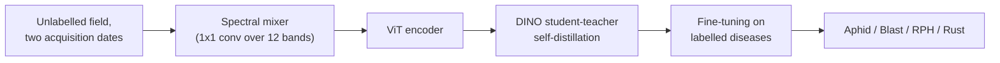

# Crop Disease Classification from Sentinel-2

Team notebooks for a Kaggle competition on crop disease prediction from Sentinel-2 imagery,
comparing a pretrained remote sensing foundation model (CROMA) with self-supervised pretraining.

Team: Emanuel ([emanuel-gf](https://github.com/emanuel-gf)), Bruna ([brunacandido](https://github.com/brunacandido)), Angelica ([Angelicarjs]https://github.com/Angelicarjs)) and Joshua Owen
Mangotang. 

## Task

Each sample is a field seen by Sentinel-2 (12 spectral bands) on one or more dates, labelled with
one of four crop diseases: **Aphid**, **Blast**, **RPH** or **Rust**. The labelled set is small and
imbalanced, but a larger set of unlabelled crop images is available, which is what the
self-supervised approaches use.

## Approaches

| Approach | Notebooks | Accuracy |
| --- | --- | ---: |
| CROMA encoder + MLP classifier with focal loss, plus class weights and data augmentation | `notebooks/croma/` | about 64% (team baseline) |
| Self-supervised pretraining from scratch, then fine-tuning | `notebooks/ssl/ssl_from_scratch.ipynb` | 31.9% (test) |
| Spectral mixer + DINO, fine-tuned | `notebooks/ssl/ssl_spectral_mixer_dino_v1.ipynb` | 49.4% (best validation) |
| Same, with a class-balanced sampler and augmentation | `notebooks/ssl/ssl_spectral_mixer_dino_v2.ipynb` | **66.1%** (best validation) |

### Spectral mixer + DINO



A learnable 1 x 1 convolution in front of the ViT mixes the 12 Sentinel-2 bands at every pixel, so
the model can discover NDVI-like band combinations itself instead of weighting all bands equally.
The encoder is pretrained with DINO on pairs of acquisitions of the same field from different
dates, which teaches it features that stay stable over time. It is then fine-tuned on the
labelled diseases; in v2 a weighted random sampler and augmentation balance the classes.

## Repository Structure

```
notebooks/
  croma/      CROMA baseline and its class-weighting and augmentation variants
  ssl/        self-supervised approaches (from scratch, spectral mixer + DINO v1 and v2)
  examples/   Kaggle starter notebook and a foundation-model practical
src/
  datasets.py Sentinel-2 disease dataset and Lightning DataModule
```

The notebooks were run on Kaggle, where the competition data is mounted; they expect the same
folder layout.
